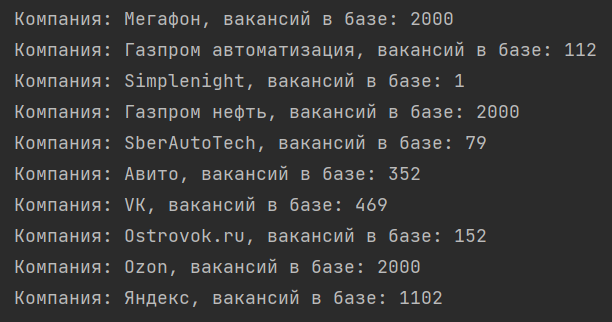
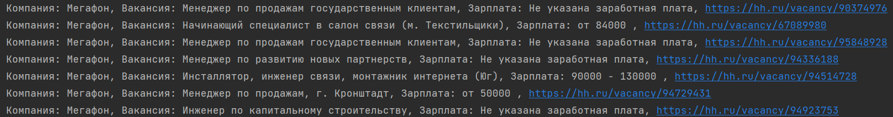
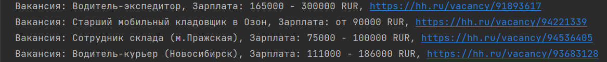
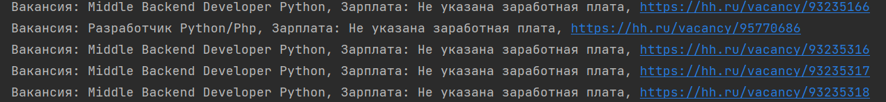

*<span style="color:purple;">Прежде чем начать работу с программой необходимо включить песню Eminem - Not Afraid.</span>* <br>
*<span style="color:purple;">Это создаст настроение и поможет вам сосредоточиться на работе.</span>* <br>
[Прослушать песню на SoundCloud](https://soundcloud.com/meybee/eminem-not-afraid?si=724a231b51824eb39947dd42253370a4&utm_source=clipboard&utm_medium=text&utm_campaign=social_sharing)


<h1 style="color: lightgreen; text-shadow: 2px 2px 4px rgba(0, 0, 0, 0.5);">Описание проекта Filenko's HH Job Hunt Master</h1>


Проект <i>Filenko's HH Job Hunt Master</i> представляет собой программу, которая загружает данные о вакансиях <br>
с сайта HeadHunter в базу данных и предоставляет различные функциональности для работы с этими данными.


<h2 style="color: lightgreen; font-size: 1em;">Список компаний в текущей версии</h2>

- Мегафон
- Simplenight
- SberAutoTech
- VK
- Авито
- Яндекс
- Ostrovok.ru
- Газпром автоматизация
- Газпром нефть
- Озон

<h2 style="color: lightgreen; font-size: 1em;">Доступные опции для пользователя</h2>

1. Получить список всех компаний и количество вакансий в каждой из них из базы данных.
   - Компании: Мегафон, Simplenight, SberAutoTech, VK, Авито, Яндекс, Ostrovok.ru, Газпром автоматизация, Газпром нефть, Озон.
   
2. Получить список всех вакансий с указанием названия компании, названия вакансии, зарплаты и ссылки на вакансию.

3. Получить среднюю зарплату по всем вакансиям.

4. Получить список всех вакансий, у которых зарплата выше средней по всем вакансиям.

5. Получить список всех вакансий по ключевому слову.

Пользователь может также загрузить свой список вакансий, и работать как с ранее загруженными вакансиями в базу, так и обновлять их и загружать новые.


<h2 style="color: lightgreen; font-size: 1em;">Результат для пользователя</h2>

При выборе опции 1 пользователь получит список всех компаний и количество вакансий в каждой из них.<br>
<br>
При выборе опции 2 пользователь получит список всех вакансий с указанием названия компании, названия вакансии, 
зарплаты и ссылки на вакансию.<br>
 <br>
При выборе опции 3 пользователь получит среднюю зарплату по всем вакансиям.<br>
 <br>
При выборе опции 4 пользователь получит список всех вакансий, у которых зарплата выше средней по всем вакансиям.<br>
 <br>
При выборе опции 5 пользователь получит список всех вакансий по ключевому слову.<br>
 <br>

<details>
  <summary><b><span style="color:blue;">Стек технологий</span></b></summary>


Для проекта <i>Filenko's HH Job Hunt Master</i> использовались следующие зависимости:

- Python версии 3.11
- Библиотека requests версии 2.32.2 для работы с HTTP-запросами
```bash
poetry add requests
```
- Библиотека psycopg2-binary версии 2.9.9 для взаимодействия с базой данных PostgreSQL
```bash
poetry add psycopg2-binary@2.9.9
```
Эти зависимости указаны в файле pyproject.toml и управляются с помощью инструмента Poetry.

</details>

<details>
  <summary><b><span style="color:blue;">Подготовка к запуску программы</span></b></summary>
  
Сначала необходимо создать базу данных и таблицы в ней.<br>
Базу данных можно создать с помощью команды в программе, например, Dbeaver.

## <span style="color: lightblue;">Установите зависимости</span>
Для проекта <i>Filenko's HH Job Hunt Master</i> использовались следующие зависимости:

- Python версии 3.11
- Библиотека requests версии 2.32.2 для работы с HTTP-запросами
```bash
poetry add requests
```
- Библиотека psycopg2-binary версии 2.9.9 для взаимодействия с базой данных PostgreSQL
```bash
poetry add psycopg2-binary@2.9.9
```

Эти зависимости указаны в файле pyproject.toml и управляются с помощью инструмента Poetry.


## <span style="color: lightblue;">Создание базы в DBeaver</span>
- Откройте DBeaver.
- Подключитесь к серверу СУБД, на котором хотите создать базу данных.
- Откройте SQL Editor для подключения.
- Вставьте команду создания базы данных 
  CREATE DATABASE имя_базы_данных;
- Выполните команду (Ctrl+Enter).
- После создание бызы данных необходимо внести данные для подключения к ней в файл sample_config.ini

## <span style="color: lightblue;">Создание таблиц</span>

Команды для создания таблиц находятся в файле db.sql.<br>
Скопируйте команды и выполните их в DBeaver.

## <span style="color: lightblue;">Загрузка данных о компаниях в базу данных</span>
```shell
python3 load_companies_to_db.py
```

Список компаний:<br>Мегафон, Simplenight, SberAutoTech, VK, Авито, Яндекс, Ostrovok.ru, Газпром автоматизация, 
Газпром нефть, Озон.<br>
Вы можете выбрать свои компании и внести их в файл companies.json. <br>Название компании и их id можно найти на сайте [hh.ru](https://hh.ru/).<br>
Компании должны быть внесены в формате:
```json
[
  {
    "name": "Название компании",
    "id": "id компании"
  },
  {
    "name": "Название компании",
    "id": "id компании"
  }
]

```
<br>
<span style="font-size: 0.8em; color: lightblue; font-style: italic;">Все подготовительные работы завершены.Теперь можно запустить программу.</span>

</details>


<details>
  <summary><b><span style="color:blue;">Запуск программы</span></b></summary>

```shell
python main.py
```
</details>

